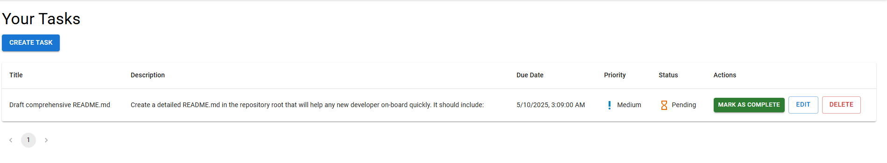

# Task Management Application

## Application Overview

The Task Management Application is a comprehensive cloud-native solution designed to help users efficiently organize and track their personal and professional tasks. Built on modern web technologies and deployed on AWS infrastructure, this application provides a secure, scalable platform for task creation, management, and tracking with a focus on user experience and reliability.

### Core Features

- Secure user registration and authentication through AWS Cognito
- Comprehensive task management with detailed metadata (title, description, due date, severity)
- Interactive dashboard with distinct views for pending and completed tasks
- Task status transitions with history tracking
- Advanced filtering and sorting by multiple criteria (due date, severity, creation date)
- Real-time updates and notifications for task changes
- Responsive design optimized for both desktop and mobile experiences

### User Flow

1. User registers an account or logs in through the secure AWS Cognito authentication flow
2. Upon successful authentication, users are directed to their personalized dashboard
3. Dashboard presents an overview of task statistics and quick-access panels
4. Users can create new tasks through an intuitive form interface with validation
5. Tasks are displayed in the pending section with visual indicators for due dates and severity
6. Users can edit task details, update status, or mark tasks as complete
7. Completed tasks are moved to a separate section with completion timestamps
8. Dashboard analytics provide insights into task completion rates and trends

## System Architecture


The application implements a cloud-native microservices architecture deployed on AWS infrastructure with Kubernetes orchestration. This architecture prioritizes scalability, resilience, and maintainability.

### Component Architecture

#### Client Layer
- Web browsers and mobile devices connect via HTTP (http://54.219.163.27) to the application frontend
- Progressive Web App (PWA) capabilities for offline functionality
- Client-side state management with Redux for predictable data flow
- Responsive UI components using Material-UI framework
- Form validation and error handling implemented client-side

#### Load Balancer (AWS Application Load Balancer)
- Distributes incoming traffic across multiple availability zones
- Implements SSL termination and forwards requests to Nginx pods

#### Nginx Pods (Frontend)
- Dedicated Nginx pods serve as the frontend web server
- Configured for static content serving with efficient caching
- Handles URL rewrites and redirects for application
- Implements compression for improved load times
- Configured with appropriate security headers and CORS policies
- Custom Nginx configuration tuned for optimal performance
- Serves the compiled React application bundle
- Routes API requests to backend services

#### Frontend Application
- React.js application with modular component architecture
- Redux for centralized state management with middleware for async operations
- React Router for client-side navigation
- Axios for API communication with request/response interceptors
- JWT token management for authentication state
- Responsive design with mobile-first approach
- Progressive enhancement for broader device support

#### Backend Pods
- Python-based REST API services built with FastAPI
- Asynchronous request handling for improved throughput
- Request validation using Pydantic models
- JWT authentication middleware for secure endpoints
- Connection pooling for database efficiency
- Rate limiting implementation at the application level
- Comprehensive API documentation with OpenAPI/Swagger
- Structured logging with correlation IDs

#### Authentication Layer
- AWS Cognito provides comprehensive identity management
- Custom user pool with appropriate password policies
- JWT token validation with proper signature verification
- MFA support for enhanced security
- Account recovery workflows
- Token refresh mechanisms for extended sessions
- User profile management

#### Data Layer
- PostgreSQL database optimized for task data structures
- Schemas designed for efficient querying of task information
- Connection pooling for handling concurrent requests
- Row-level security for multi-tenant isolation
- Encryption at rest for sensitive data
- Regular backup schedule with point-in-time recovery

### Network Architecture

The application is deployed across carefully segmented network zones:

- **Public Zone**: Contains AWS Application Load Balancer with public IP that handles incoming traffic
- **Application Zone**: Houses EKS cluster with frontend Nginx pods and backend API pods
- **Data Zone**: Contains RDS instances and other persistence services

Each zone has specific security groups and access controls to enforce least privilege principles.

### Data Flow

1. Client initiates request to the application URL
2. AWS Application Load Balancer receives the request and routes to available Nginx pods
3. Nginx pod serves static assets directly or forwards API requests to backend pods
4. For protected resources, the request includes JWT token in Authorization header
5. Backend pods validate the token with Cognito before processing requests
6. Business logic is executed and database operations performed as needed
7. Response data is formatted according to API.
8. Response traverses back through the backend pod to Nginx
9. Nginx returns the response to the client via the load balancer
10. Client processes and renders the response data

## Infrastructure Components

The infrastructure is provisioned using Terraform with a focus on security, scalability, and operational excellence.

### AWS Resources

#### Compute Resources
- **Amazon EKS**: Managed Kubernetes cluster (version 1.24+) for container orchestration
- **EKS Node Groups**: EC2 instances (t3.medium) configured in auto-scaling groups
- **EKS Cluster Autoscaler**: Dynamic adjustment of compute capacity based on demand patterns


#### Database Resources
- **Amazon RDS for PostgreSQL 14**: Managed relational database for task storage
- **Multi-AZ Deployment**: Synchronous replication across availability zones
- **Read Replicas**: For scaling read operations and reporting queries
- **Performance Insights**: Database performance monitoring and analysis
- **Automated Backup Schedule**: Daily snapshots with 14-day retention
- **Parameter Groups**: Optimized database settings for application workload

#### Network Resources
- **VPC**: Isolated network environment (CIDR 10.0.0.0/16)
- **Public Subnets**: In 2 AZs for load balancers, Application Components and NAT gateways
- **Private Subnets**: In 2 AZs for database resources
- **Security Groups**: Granular access control with specific rules (pods in kubernetes cluster can communicate to database in private subnets)
- **Network ACLs**: Additional subnet-level security
- **NAT Gateways**: Providing outbound internet access for private resources 
- **VPC Gateway Endpoints**: For secure access to AWS services without internet exposure (connecting to private s3 where we are storing terraform state file)

#### Security Resources
- **AWS Cognito**: Authentication service with custom user pools
- **IAM Roles**: Fine-grained permissions following least privilege principle
- **GITHUB Secrets** - Storing the Sensitive Values of application and AWS Resources
  
#### Storage Resources
- **S3 Buckets**: For storing the terraform state files

### Terraform Configuration

The infrastructure is defined using Terraform with configurations for:
- Core VPC network with properly sized subnets (10.0.0.0/16 with /20 subnets)
- EKS cluster with version 1.24+ and associated node groups
- RDS PostgreSQL instances with 100GB storage, configured for Multi-AZ
- Cognito user pools with custom attributes and appropriate security settings
- IAM roles and policies with least privilege permissions
- CloudWatch log groups with 30-day retention
- Security groups with specific ingress/egress rules
- S3 buckets with appropriate lifecycle policies
- Auto-scaling policies based on CPU/memory metrics

## Deployment Process

The application follows a robust CI/CD pipeline implemented with GitHub Actions, ensuring reliable and consistent deployments.

### CI/CD Pipeline

The GitHub Actions workflows automate the entire build and deployment process:

1. **Code Quality Phase**
   - Code checkout from repository
  
2. **Infrastructure Phase** (Infrastructure Pipeline - Create Entire AWS Infrastructure needed for application)
   - Terraform code validation
   - Terraform plan
   - Terraform apply with proper state management with storing state file in s3
   - Post-apply validation checks
  
3. **CI/CD Phase**
   - Frontend build with webpack optimization
   - Backend dependency resolution
   - Docker image building with multi-stage builds
   - Push the Docker Image to AWS ECR
   - Image tagging with commit SHA and semantic version
   - Vulnerability Scanning with Amazon Inspector

4. **Deployment Phase**
   - Push Docker images to Amazon ECR with proper tags
   - Generate Kubernetes manifests with kustomize
   - Update image references in Kubernetes manifests
   - Apply Kubernetes configurations with kubectl
   - Sequential deployment by environment (dev → staging → production)
   - Post-deployment health checks
   - Automated rollback procedures if health checks fail

### Kubernetes Deployment

The application is deployed to EKS using a comprehensive set of Kubernetes resources:

- **Namespaces**: Logical separation between environments and workloads
- **Deployments**: Define pod specifications with 2 replicas per service
- **Services**: Enable network communication with appropriate selector labels
- **HorizontalPodAutoscalers**: Scale based on CPU (target: 70%) and memory metrics

The deployment strategy implements:
- Rolling updates with maxSurge=25% and maxUnavailable=25%
- Readiness probes with initialDelaySeconds=30s and periodSeconds=10s
- Liveness probes to detect and restart unhealthy containers
- Resource requests and limits precisely calculated based on workload

## API Endpoints

The application exposes a comprehensive set of RESTful API endpoints:

### Authentication Endpoints
- `POST /api/auth/register`: User registration (redirects to Cognito flow)
- `POST /api/auth/login`: User login (redirects to Cognito flow)
- `POST /api/auth/logout`: Logout user and invalidate session tokens
- `GET /api/auth/user`: Retrieve current user profile information
- `PUT /api/auth/user`: Update user profile information
- `POST /api/auth/refresh`: Refresh access token using refresh token

### Task Management Endpoints
- `GET /api/tasks`: List all tasks for authenticated user (supports pagination and filtering)
- `POST /api/tasks`: Create a new task with validation
- `GET /api/tasks/{id}`: Retrieve specific task by UUID
- `PUT /api/tasks/{id}`: Update all fields of a specific task
- `PATCH /api/tasks/{id}`: Partially update specific task fields
- `DELETE /api/tasks/{id}`: Delete specific task (soft delete with archive flag)
- `PATCH /api/tasks/{id}/complete`: Mark task as complete with completion timestamp
- `PATCH /api/tasks/{id}/reopen`: Reopen a previously completed task
- `GET /api/tasks/{id}/history`: Retrieve modification history of a task

### Dashboard Endpoints
- `GET /api/dashboard/summary`: Retrieve task statistics and counts
- `GET /api/dashboard/pending`: List all pending tasks with filtering options
- `GET /api/dashboard/completed`: List all completed tasks with filtering options
- `GET /api/dashboard/by-severity`: Get tasks grouped by severity levels
- `GET /api/dashboard/by-due-date`: Get tasks grouped by due date ranges
- `GET /api/dashboard/overdue`: Get all overdue tasks
- `GET /api/dashboard/analytics`: Get task completion analytics and trends

### API Request/Response Format

All API endpoints follow consistent patterns:

**Request Format**:
- Authentication: Bearer token in Authorization header
- Content-Type: application/json
- Query parameters for filtering and pagination
- Path parameters for resource identifiers
- Request body in JSON format for POST/PUT/PATCH operations

**Response Format**:
- HTTP status codes follow standard conventions (200, 201, 400, 401, 403, 404, 500)
- Content-Type: application/json
- Response body structure:
  ```json
  {
    "data": { /* response data */ },
    "meta": {
      "pagination": {
        "total": 100,
        "page": 1,
        "per_page": 20,
        "pages": 5
      }
    },
    "errors": [] /* array of error objects if applicable */
  }
  ```
- Error response structure:
  ```json
  {
    "errors": [
      {
        "code": "VALIDATION_ERROR",
        "message": "Due date cannot be in the past",
        "field": "due_date"
      }
    ]
  }
  ```

## Authentication Flow

The application implements a secure OAuth 2.0 authentication flow with AWS Cognito:

1. **Initial Login Request**: 
   - User clicks login button on the frontend application
   - Frontend initiates OAuth flow with Cognito
   - Frontend redirects to AWS Cognito hosted UI with client_id, redirect_uri, and scope parameters

2. **Cognito Authentication**:
   - User enters credentials on the AWS Cognito login page
   - Cognito validates credentials against the user pool
   - Failed attempts are rate-limited (maximum 3 attempts with in a minute)
   - Multi-factor authentication is triggered
   - User completes MFA challenge 

3. **Token Issuance**:
   - Cognito issues three JWT tokens upon successful authentication:
     - ID token: Contains user identity information (sub, email, name, custom attributes)
     - Access token: Used for API authorization with appropriate scopes
     - Refresh token: Long-lived token for obtaining new tokens (valid for 30 days)
   - Tokens are signed with RS256 algorithm using Cognito's key pairs
   - Tokens include expiration times (1 hour for access/ID tokens)

4. **Application Callback**:
   - Cognito redirects back to the application's redirect_uri with authorization code
   - Frontend exchanges code for tokens using client_id and client_secret
   - Frontend validates token signature and claims
   - Frontend stores tokens securely in browser storage (httpOnly cookies)
   - User session is established in the application

5. **Authenticated Requests**:
   - Access token is included in Authorization header for all API requests
   - Backend validates token signature, expiration, audience, and issuer
   - Backend extracts user identity from token claims
   - Authorization decisions are made based on user roles and permissions
   - Resource access is granted or denied accordingly

6. **Token Refresh**:
   - Frontend monitors token expiration time
   - When access token nears expiration (e.g., 5 minutes before), refresh flow is triggered
   - Refresh token is used to obtain new access and ID tokens
   - If refresh token is expired or invalid, user is redirected to login

7. **Logout Process**:
   - Frontend initiates logout by calling Cognito logout endpoint
   - Tokens are revoked on the Cognito side
   - Local tokens are removed from browser storage
   - User session is terminated
   - User is redirected to the login page or home page

## Monitoring and Maintenance

The application implements comprehensive monitoring and maintenance procedures:

### Monitoring Components

- **Logging Infrastructure**:
  - Structured JSON logs with standardized fields
  - Log levels (DEBUG, INFO, WARN, ERROR, FATAL)
  - Correlation IDs for request tracing
  - Log retention policies (30 days for standard, 7 years for audit logs)

## Screenshots




![Rate Limiting])./rate-limiting.png
